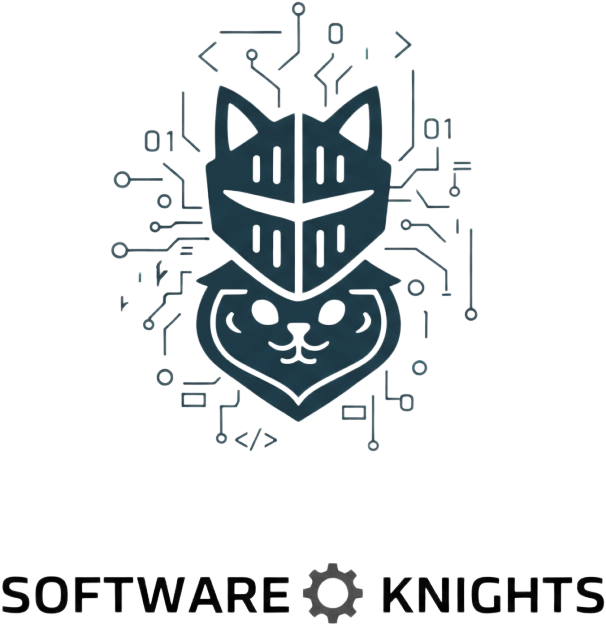

<!-- ALL-CONTRIBUTORS-BADGE:START - Do not remove or modify this section -->

<!-- ALL-CONTRIBUTORS-BADGE:END -->

  <h1>HachimiONanbayLyudou</h1>
  
  
  

     Software Engineering Group HachimiONanbayLyudou, Fuzhou University, 2025  
  

**团队介绍：** 

  

    “名为生活的大风车,我要和你大战三百回合”
  

我们是“哈基米噢南北绿豆”团队，  
脑洞可以上天，交付必须落地；抽象是皮肤，靠谱是内核。  
纵使学习过程艰难曲折，我们也会以骑士精神继续前进，完成任务。  

### 设计灵感
这个骑着猫的骑士Logo设计灵感，结合了软件工程团队的核心特质与艺术趣味。
- 骑士象征团队守护代码世界的使命感，猫代表技术的灵活性与独特性，两者结合体现软件工程师对技术的掌控力和创新精神。
- 电路板与二进制元素强调技术的逻辑性与复杂性，整体设计在趣味性与技术性间取得平衡，彰显团队用技术力量解决复杂问题、守护技术可靠性的决心。

### 生成过程
我们使用Gemini 2.5，将猫咪骑士的图片交给AI，并告诉AI根据该图片和计算机软件工程元素生成团队LOGO

## Contributors

<!-- ALL-CONTRIBUTORS-LIST:START - Do not remove or modify this section -->
<!-- prettier-ignore-start -->
<!-- markdownlint-disable -->
<table>
  <tbody>
    <tr>
      <td align="center" valign="top" width="14.28%"><a href="https://github.com/FantasyRL"> <b>FanR</b></a> <a href="https://github.com/FantasyRL/HachimiONanbayLyudou/commits?author=FantasyRL" title="Code">💻</a></td>
      <td align="center" valign="top" width="14.28%"><a href="https://github.com/RealSeverj"> <b>Severj</b></a> <a href="https://github.com/FantasyRL/HachimiONanbayLyudou/commits?author=RealSeverj" title="Code">💻</a></td>
      <td align="center" valign="top" width="14.28%"><a href="https://github.com/1022394845"> <b>QingFeng</b></a> <a href="https://github.com/FantasyRL/HachimiONanbayLyudou/commits?author=1022394845" title="Code">💻</a></td>
      <td align="center" valign="top" width="14.28%"><a href="https://github.com/Kkkrran"> <b>ZhiWei</b></a> <a href="https://github.com/FantasyRL/HachimiONanbayLyudou/commits?author=Kkkrran" title="Code">💻</a></td>
      <td align="center" valign="top" width="14.28%"><a href="https://github.com/REREREGO"> <b>REREREGO</b></a> <a href="https://github.com/FantasyRL/HachimiONanbayLyudou/commits?author=REREREGO" title="Code">💻</a></td>
      <td align="center" valign="top" width="14.28%"><a href="https://github.com/nbdxwbl"> <b>nbdxwbl</b></a> <a href="https://github.com/FantasyRL/HachimiONanbayLyudou/commits?author=nbdxwbl" title="Code">💻</a></td>
      <td align="center" valign="top" width="14.28%"><a href="https://github.com/MonaranBai"> <b>MonaranBai</b></a> <a href="https://github.com/FantasyRL/HachimiONanbayLyudou/commits?author=MonaranBai" title="Code">💻</a></td>
    </tr>
    <tr>
      <td align="center" valign="top" width="14.28%"><a href="https://github.com/102301540"> <b>102301540</b></a> <a href="https://github.com/FantasyRL/HachimiONanbayLyudou/commits?author=102301540" title="Code">💻</a></td>
      <td align="center" valign="top" width="14.28%"><a href="https://github.com/aoffw"> <b>aoffw</b></a> <a href="https://github.com/FantasyRL/HachimiONanbayLyudou/commits?author=aoffw" title="Code">💻</a></td>
      <td align="center" valign="top" width="14.28%"><a href="https://github.com/blacksheep1118"> <b>blacksheep1118</b></a> <a href="https://github.com/FantasyRL/HachimiONanbayLyudou/commits?author=blacksheep1118" title="Code">💻</a></td>
      <td align="center" valign="top" width="14.28%"><a href="https://github.com/ybdw666666"> <b>ybdw666666</b></a> <a href="https://github.com/FantasyRL/HachimiONanbayLyudou/commits?author=ybdw666666" title="Code">💻</a></td>
      <td align="center" valign="top" width="14.28%"><a href="https://github.com/richhhh151"> <b>richhhh151</b></a> <a href="https://github.com/FantasyRL/HachimiONanbayLyudou/commits?author=richhhh151" title="Code">💻</a></td>
    </tr>
  </tbody>
</table>

<!-- markdownlint-restore -->
<!-- prettier-ignore-end -->

<!-- ALL-CONTRIBUTORS-LIST:END -->
<!-- prettier-ignore-start -->
<!-- markdownlint-disable -->

<!-- markdownlint-restore -->
<!-- prettier-ignore-end -->

<!-- ALL-CONTRIBUTORS-LIST:END -->
